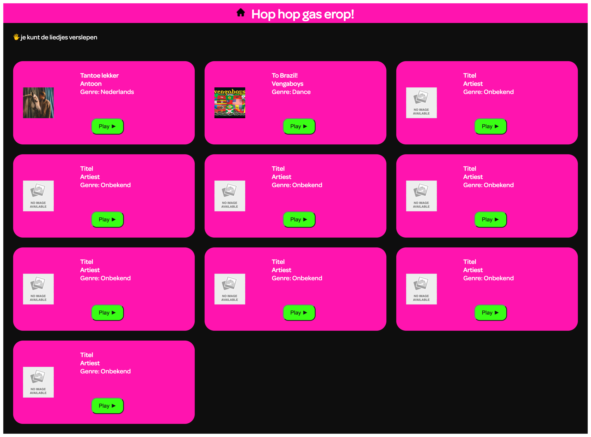

# Procesverslag
**Auteur:** Julia Hop

**De opdrachten:** [opdracht 1](opdracht1/index.html) en [opdracht 2](opdracht2/index.html)

Markdown is een simpele manier om HTML te schrijven.  
Markdown cheat cheet: [Hulp bij het schrijven van Markdown](https://github.com/adam-p/markdown-here/wiki/Markdown-Cheatsheet).

Nb. De standaardstructuur en de spartaanse opmaak van de README.md zijn helemaal prima. Het gaat om de inhoud van je procesverslag. Besteedt de tijd voor pracht en praal aan je website.

Nb. Door *open* toe te voegen aan een *details* element kun je deze standaard open zetten. Fijn om dat steeds voor de relevante stuk(ken) te doen.

## Bronnenlijst
  1. https://www.youtube.com/watch?v=CZTCciHE72I&t=601s (vanaf 8:50)
  2. https://www.youtube.com/watch?v=wffK2OIt8u0&t=367s
  3. https://sortablejs.github.io/Sortable/#shared-lists
  4. https://codepen.io/shooft/pen/bGYgoeO
  5. https://css-tricks.com/snippets/css/complete-guide-grid/

## Opdracht 1 plan

  
uitwerken na schetsen idee (voor week 2)

  ### Je storyboard:
  

  ### Je ambitie: 
  Aan deze technieken/punten wil ik werken:
  - Text fade-in transition
  - Color fade-in transition
  - Afbeeldingen (de bellenblaas) kunnen verplaatsen van onder naar boven in een soort tijdlijn
  - Belletjes door een cirkel kunnen laten gaan
  - Belletjes omhoog laten zweven

  ### Je logo:
   

  ### Je font: 
  Similar font:
  

 

## Opdracht 1 reflectie

  
uitwerken bij afronden opdracht (voor week 3)

  ### Je uitkomst - karakteristiek screenshot(s):
  

  ### Dit ging goed/Heb ik geleerd: 
  Van te voren leek het mij lastig om zelf vormen te maken, maar dit vond ik uiteindelijk meevallen. Wel vond ik het lastig om de vormen responsive te maken, dus daarbij had ik hulp gevraagd en toen heb ik geleerd dat je dan met vmin moet werken. Ook leek het mij lastig om de belletjes te laten zweven, maar daarvoor kwam ik een handige tutorial tegen (zie bronnen) en met hulp daarvan heb ik dus reëele belletjes kunnen maken. De color gradient animatie heb ik gemaakt met behulp van voorbeeldopdrachten van FED. Ik vind dat de color gradient mooi is gelukt en de in-fade animatie ging ook goed.

  ### Dit was lastig/Is niet gelukt:
  Als ik meer tijd had had ik misschien die belletjes later in beeld willen laten komen, want nu zie je ze al gelijk in de 'o' zitten en eigenlijk wil ik dat ze pas komen wanneer de bellenblaas op zijn plek staat.

## Opdracht 2 plan

  
uitwerken na schetsen idee (voor week 4)

  ### Je ontwerp:
  

  ### Je ambitie: 
  Aan deze technieken/punten wil ik werken:
  - Drag & drop
  - Shared lists
  - Audio
  - Grid

## Opdracht 2 test

  
uitwerken na testen (week 6/7)

  Neem minimaal 5 bevindingen op:

  ### Bevinding 1:
  Ik gebruikte meerdere ID's vaker en dat mag niet, want een ID mag maar 1 keer voorkomen op een pagina. Dat is voor CSS op zich niet zo'n probleem maar voor JS wel.

  #### oplossing:
  Ik had allemaal ID's met 'song'. Ik heb al die ID's weggehaald en het er een normale li van gemaakt. Qua styling (css) veranderde er niks toen ik i.p.v. #song li neerzette. Dit komt omdat ik voor elke html pagina een apart css-bestand heb.

  Dit gaat om regel 35 t/m 110 in index.html.

  

  ### Bevinding 2:
  Ik heb 2 html pagina's en eerst had ik 1 css-bestand en 1 javascript bestand, maar hierdoor moest ik heel veel classes en id's gebruiken, zodat er niets werd overgeschreven. Dit was onhandig, omdat het hierdoor rommelig en overzichtelijk werd.

  #### oplossing:
  Ik heb nu 3 verschillende css-bestanden en 3 verschillende javascript-bestanden. Daarvan is bij beide 1 gezamelijk, 1 voor index.html en 1 voor list.html.

  ### Bevinding 3:
  Ik kreeg de tekst en de button in het groene vlak eerst niet mooi onder elkaar (zie afbeelding). Ik probeerde het eerst namelijk te ordenen met grid-row en grid-column.

  #### oplossing:
  Het bleek dat ik dit moest ordenen met grid-column-end en grid-column-start.

  

  ### Bevinding 4:
  Ik wist niet hoe ik de ul moest centeren tussen de button en de img. Ik probeerde dit met justify-self: center;

  #### oplossing:
  De oplossing is met flex-grow: 1;, text-align: center; en margin-right: 2rem;

  

  ### Bevinding 5:
  De tags stonden eerst van boven naar beneden, maar ik wilde ze van links naar rechts. Ik had al grid-column-end en grid-column-start gebruikt, maar dit bleek niet genoeg te zijn.

  #### oplossing:
  Het bleek dat ik flex-shrink: 0; erbij moest zetten. Flex-shrink schijnt de eigenschap te hebben om een flex-item te kunnen laten krimpen. Want de maat van de buttons waren te groot voor het flexcontainer/grid.

  

## Opdracht 2 reflectie

  
uitwerken bij afronden opdracht (voor week 8)

  ### Je uitkomst - karakteristiek screenshot(s):
  
  

  ### Dit ging goed/Heb ik geleerd: 
  Ik heb veel geleerd over het ordenen van mijn html, css en javascript. Ook heb ik heel veel geleerd over grid. Eerst vond ik het lastig om inzicht te krijen erop, maar nu snap ik hoe het in elkaar zit. Ook heb ik geleerd hoe je audio kunt laten afspelen en ik heb geleerd over drag en drop.

  ### Dit was lastig/Is niet gelukt:
  Ik vond ook heel veel dingen lastig, want ik was soms echt even het overzicht kwijt en daardoor verloor ik soms de motivatie om door te gaan. Ook merk ik dat ik nog erg veel hulp nodig heb en niet heel goed zelfstandig kan coderen.Ik kreeg 'shared lists' nog niet voor elkaar en ik heb nog moeite met dingen aanroepen met dezelfde naam, zoals als er 10 li's zijn. Dus nu zijn mijn play/pause buttons niet meer goed aangeroepen. Verder was mijn plan nog om als ik op een tag druk, zoals 'Nederlands' dat er dan alleen liedjes met het genre 'Nederlands' in beeld zijn en de rest van de nummers weggaan, maar dit leek me iets te ambitieus en ik kon ook niet zo snel bedenken hoe dit moest.

